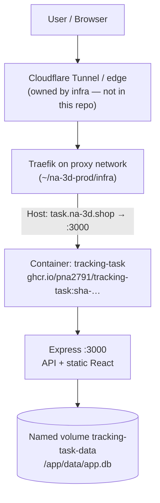
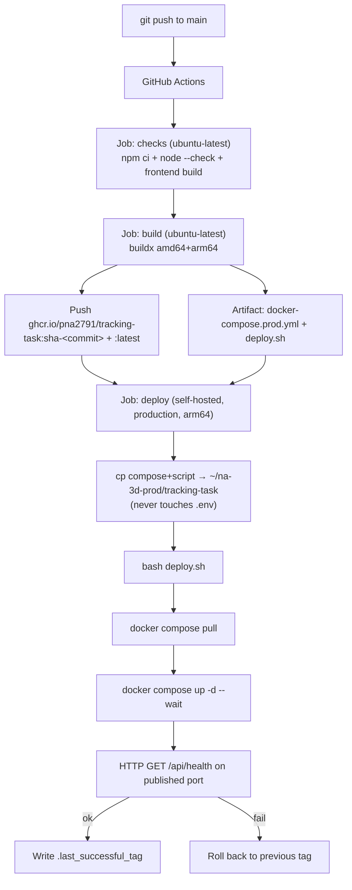

# tracking-task — Architecture & Production Deployment

> Maintainer reference for how this service plugs into the existing **na-3d**
> production stack (same model as Text-Slicer and 3d-printing-website).
> Anything not verifiable from this repository is marked **UNKNOWN**.

## Project Overview

**tracking-task** is a single-user mind-map task manager (React + Express +
SQLite). One container serves both the API and the built frontend. Public
hostname in production: **`task.na-3d.shop`**.

| Layer | Technology |
|-------|------------|
| Frontend | React 18, Vite, React Flow, Tailwind |
| Backend | Node.js 20, Express |
| Database | SQLite (`better-sqlite3`), file at `/app/data/app.db` |
| Packaging | Multi-stage Docker image → GHCR |
| CI/CD | GitHub Actions + self-hosted production runner |
| Reverse proxy | Traefik (infra stack), external Docker network `proxy` |

## Production Topology



Sibling services on the same machine (`~/na-3d-prod/`):

| Path | Role |
|------|------|
| `infra/` | Traefik + `proxy` network + tunnel — **do not modify from this repo** |
| `text-slicer/` | Text-Slicer (`text.na-3d.shop`) |
| `3d-printing-website/` | Storefront (`na-3d.shop`) |
| `tracking-task/` | **This service** (`task.na-3d.shop`) |

## Deployment Flow



**Rules (same as Text-Slicer):**

- Zero build on production — only `pull` + `up -d`.
- No SSH / SCP deploy — the self-hosted runner already runs on the MacBook.
- No `git clone` on production — CI copies only `docker-compose.prod.yml` and `deploy.sh`.
- `.env` is never created non-empty or overwritten by CI.
- Named volume is never removed (`no down -v`).

## Docker Image

| Aspect | Value |
|--------|-------|
| Dockerfile | Multi-stage: frontend build → native deps → slim runtime |
| Base | `node:20-bookworm-slim` |
| User | non-root `app` (uid 1001) |
| Internal port | `3000` (`EXPOSE 3000`) |
| Healthcheck | `GET /api/health` via Node `fetch` |
| Registry | `ghcr.io/pna2791/tracking-task` |
| Tags | `sha-<git-sha>` (deployed) and `latest` (convenience) |
| Seed | `/app/seed/app.db` copied into the volume on **first boot only** |

## Compose (production)

`docker-compose.prod.yml`:

- Image: `${TASK_IMAGE}` (required; set by `deploy.sh`)
- Host port: `${TASK_PORT:-3100}:3000`
- Networks: `default` + external `proxy`
- Volume: `tracking-task-data` → `/app/data`
- Restart: `unless-stopped`
- Traefik labels:
  - Router: `task`
  - Rule: `Host(\`task.na-3d.shop\`)`
  - Entrypoint: `web`
  - Service port: `3000`
  - Middlewares: `secure-headers@file,compress@file`
  - Network: `proxy`

## Runner & GHCR

| Piece | Detail |
|-------|--------|
| Runner labels | `self-hosted`, `production`, `arm64` |
| Runner location | Production MacBook Air M1 (`~/na-3d-prod/…`) |
| GHCR auth | Workflow `GITHUB_TOKEN` (`packages: write` build, `packages: read` deploy) |
| Deploy path | `$HOME/na-3d-prod/tracking-task` (override with repo Variable `DEPLOY_PATH`) |

## Health Check & Rollback

1. Compose healthcheck + `up --wait` gate container readiness.
2. `deploy.sh` then probes `http://127.0.0.1:${TASK_PORT:-3100}/api/health`.
3. Success → write `.last_successful_tag`.
4. Failure → `docker compose logs`, then re-deploy the previous tag from `.last_successful_tag`.
5. If no previous tag (or rollback also fails) → deploy exits non-zero for manual intervention.

## GitHub Secrets & Variables

| Kind | Name | Required? | Purpose |
|------|------|-----------|---------|
| Secret | `GITHUB_TOKEN` | Auto | Push/pull GHCR packages (no separate `GHCR_TOKEN` needed — same as Text-Slicer) |
| Variable | `DEPLOY_PATH` | Optional | Override deploy dir; default `$HOME/na-3d-prod/tracking-task` |
| Environment | `production` | Recommended | Gates the deploy job (approvals/protection configured in GitHub UI) |

**Not required in GitHub:** runtime app secrets. Optional host config lives only in
the server `.env` (see `.env.production.example`).

### Server `.env` keys

| Variable | Default | Purpose |
|----------|---------|---------|
| `TASK_PORT` | `3100` | Host port for localhost health probes |
| `TZ` | `Asia/Ho_Chi_Minh` | Container timezone |
| `ACCESS_PASSWORD` | `Derichs2026` | Password for the site login gate (`/login`) |
| `COOKIE_SECURE` | `false` | Set `true` if the public URL is HTTPS-only |
| `HEALTH_WAIT_TIMEOUT` | `180` | Seconds for `up --wait` (env for `deploy.sh`) |

`TASK_IMAGE` / `TASK_IMAGE_REPO` / `IMAGE_TAG` are set by CI/`deploy.sh`, not by hand.

## Production Directory Layout

```
~/na-3d-prod/
├── infra/                         # Traefik + proxy network (DO NOT TOUCH from this repo)
├── text-slicer/
├── 3d-printing-website/
└── tracking-task/                 # created on first deploy (or manually beforehand)
    ├── docker-compose.prod.yml    # overwritten by CI each deploy
    ├── deploy.sh                  # overwritten by CI each deploy
    ├── .env                       # NEVER touched by CI (create once)
    └── .last_successful_tag       # written by deploy.sh only
```

Docker named volume `tracking-task_tracking-task-data` (or project-prefixed
equivalent) holds SQLite data outside this directory.

## First Production Release

1. Ensure infra is up (`proxy` network + Traefik + Cloudflare route for `task.na-3d.shop`).
2. On the production MacBook:
   ```bash
   mkdir -p ~/na-3d-prod/tracking-task
   cp /path/to/.env.production.example ~/na-3d-prod/tracking-task/.env
   # edit TASK_PORT if 3100 is taken
   ```
3. In GitHub → repo **Settings → Environments**, create `production` if missing.
4. Confirm the self-hosted runner has labels `self-hosted`, `production`, `arm64`.
5. Push to `main` (or run **Actions → Build & Deploy to Production → Run workflow**).
6. Watch the `deploy` job; then open `http://task.na-3d.shop` (via tunnel) or
   `http://127.0.0.1:3100/api/health` on the server.
7. First container boot seeds SQLite from the image-baked `data/app.db` into the
   named volume; later deploys leave that volume alone.

## Local Development

Use `docker-compose.yml` (build locally, bind-mount `./data`). Do **not** use
`docker-compose.prod.yml` locally unless you set `TASK_IMAGE` and have an
external `proxy` network.

## Assumptions

- DNS / Cloudflare Tunnel hostname `task.na-3d.shop` is configured in **infra**
  (outside this repo) the same way as `text.na-3d.shop`.
- Traefik middlewares `secure-headers@file` and `compress@file` already exist
  in the infra dynamic config.
- The production runner labels match Text-Slicer (`self-hosted, production, arm64`).
  If your runner only has the website labels (`macOS`, `ARM64`), update either
  the runner or this workflow’s `runs-on` to match — **confirm on the server**.
- Package visibility: GHCR package linked to this GitHub repository so
  `GITHUB_TOKEN` can pull from the deploy job.
